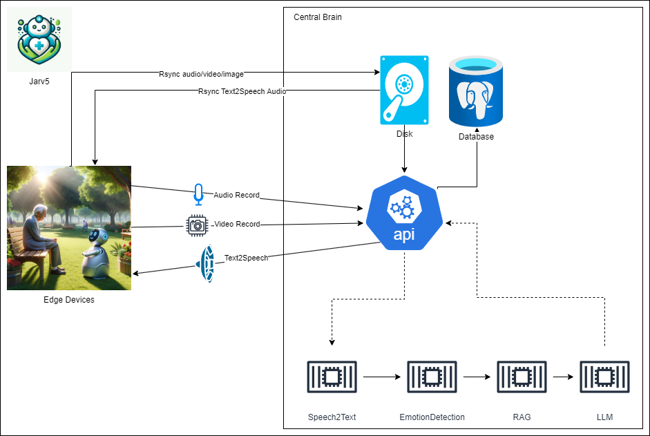

# Jarv5

This is an end to end conversational AI system framework.

Video and Audio input are collected from hardware devices, then send to the API for the downstream processing.

The output in the end will be text and then transformed to speech.

Client side then will be notified to play the speech.

## Main Components

Three components:

- Client
    - Input:
        - Audio
        - Video
    - Output:
        - Text to Speech
- API:
    - Knowledge base (Relational Database + Graph Database)
    - Model Orchestration (LLM, GPT-4 API, self-developed models)
    - Data processing
- Web
    - Chat interface
    - Data management

## Architecture

