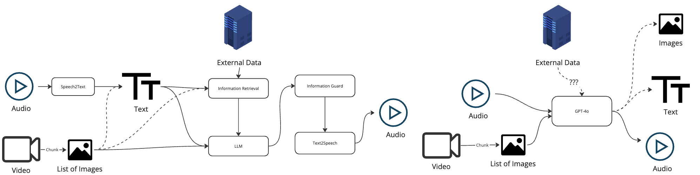

# OpenBenang

**Benang** means tomorrow in Western Australia Noongar Language.



For an end to end conversational AI system, currently, there are mainly two approaches:

- Right side is what we think OpenAI GPT-4o is doing.
- Left side is what traditional conversational AI is doing.

As demonstrated in their video, OpenAI is working on an end-to-end model, which is quite impressive and theoretically
state-of-the-art.

However, there are challenges:

- We do not know how they implement it or why they can achieve such results.
- Fully end-to-end models are difficult to implement because most researchers lack the resources (**money** and **data
  **) to train such models.

To reach the level of OpenAI, we need:

1. **Collaborative Efforts**: Crowd efforts where everyone focuses on advancing their own part without reinventing the
   wheel.
2. **High Agility**: A process that allows people to easily test their models, understand real application issues, and
   improve them.
3. **Gathering Data**: More data to advance system development, especially for complex conversational scenarios. This
   includes understanding who is talking, the context, and the emotion, which is lacking in current datasets.

To address these needs, we are building **OpenBenang**, a system that:

- Allows people to easily test their models, whether end-to-end or single components within the pipeline.
- Can be easily deployed, enabling researchers to collect the data they need with minimal effort for adaptation.

Our ultimate goal is to:

- Develop an open-source, end-to-end conversational AI robot that match the capabilities of OpenAI's GPT-4o.
- Enable easy data collection for advancing the development of end-to-end conversational AI systems.
- Inspire and foster the development of innovative conversational AI applications and products.

## System Operation Overview

1. **Data Collection:** Video and audio inputs are collected from hardware devices.
2. **Data Transfer:** Data is sent to the API for downstream processing.
3. **Data Processing:** The API uses AI and ML models to process the data, generate responses.
4. **Reaction:** The client side is notified to play the speech.

There are two key metrics we are focusing on:

- **Model Latency:** The time it takes for the model to generate a response.
- **Model Accuracy:** Whether the model generates the in-context response or accurate response.

In the end we will want to respond to the user's query in a timely manner, and provide the most in-context response.

---

## Architecture


---

## Main Components

From Application Development Perspective, we divide the whole applications into three main components:

- Client
- API
- AI
- Web

### Client

Detailed information can be found in [Client](docs/Client/main).

Client is decoupled from the API, to reduce the complexity of the system, and allow researchers or developers easily
integrate their own model into the system.

The client side will mainly in charge of

- Data Acquisition
    - Audio
    - Video
- Data Transfer
    - Transfer the data to storage places
- Data Presentation
    - Play the speech

### API

Detailed information can be found in [API](./docs/API.md).

This is the **Brain** of the system, which will be in charge of:

- Knowledge Base
    - Relational Database
    - Graph Database
- Models Orchestration
    - LLM
    - GPT-4 API
    - Self-developed models
- API Interface
    - RESTful API
    - WebSocket API
- Data Management

### AI

Detailed information can be found in [AI](./docs/AI.md).

- Running the ML or AI models
    - Running the models which require intensive computation
    - LLM models
    - Text2Speech models
    - Emotion Recognition models
    - etc.

The API side will work as the orchestrator, to manage the models, and provide the interface for the client to access

### Web

Detailed information can be found in [Web](./docs/Web.md).

- It will provide a real-time interface for the user to view the progress of the end to end conversation process.
- It will also provide an interface for the user to doing the annotation, and evaluation of the system.

---

## Applications

### Aged Care

We'll start by developing a conversational AI system specifically designed for the aged care sector,
focusing on individuals who require nursing care at home.

Two main features:

- Monitoring and Nursing: Make sure they take their medication, eat well, and exercise regularly.
- Emotional Support: Provide companionship and emotional support.

## Development Environment Setup

To get this project end to end running, you need to set up the following:

- Client
    - Audio Acquisition
    - Video Acquisition
    - File Sync [Optional]
    - Text to Speech
- API
    - API
    - Audio Transcription
    - Emotion Recognition

Before you start, you will need to clone this repo to your local machine.

---

### Client

You will need to make sure your device includes the following hardware:

- Microphone
- Camera
- Speaker

Note: If you are running the client on Windows WSL, you probably cannot access the camera/microphone/speaker
directly [TODO].
You will need to run it on a real Windows machine via PowerShell.

#### Audio Acquisition

```bash
cd ./Client/Listener
# create a virtual environment
python3 -m venv venv
source venv/bin/activate
pip install -r requirements.txt
python3 audios_acquire.py --api_domain http://localhost:8000 --token xxx_create_a_token_from_api_xxx --model medium
# it then will start to listen to the audio and send it to the API
```

#### Video Acquisition

```bash
cd ./Client/Listener
# create a virtual environment, if you have done it for audio, you can skip this step
# python -m venv venv
source venv/bin/activate
# pip install -r requirements.txt
python3 videos_acquire.py --api_domain http://localhost:8000 --token xxx_create_a_token_from_api_xxx
```

#### File Sync

You will only need to run this when we deploy the client on the Raspberry Pi, and the Central Brain is running on a
server.

```bash
cd ./Client/Listener
# create a virtual environment, if you have done it for audio, you can skip this step
# python -m venv venv
source venv/bin/activate
# pip install -r requirements.txt
python3 sync_files.py # with proper configurations
# TODO: this needs further implementation to be more production-ready
```

#### Text to Speech

This is looping to check from the API side whether there is any new text to be spoken.

```bash
cd ./Client/Responder
# create a virtual environment
python3 -m venv venv
source venv/bin/activate
pip install -r requirements.txt
python3 text_to_speech.py --api_domain http://localhost:8000 --token xxx_create_a_token_from_api_xxx
```

-----

### API

#### API Server

```bash
cd ./API
docker compose up
```

This should be able to start the API, and you can access

- admin: http://localhost:8000/
- api docs: http://localhost:8000/redoc

Username and password are `admin/password`.

#### Audio Transcription

It can be run within the container, actually, it is already running in the container, you can check the worker
container.
There is a `worker` container running in the background, listen for LLM queued tasks.

However, running inside containers will have much lower performance compared to running on the host machine.

So to get a more efficient transcription, you can run it on the host machine.

```bash
cd ./API
# create a virtual environment
python3 -m venv venv
source venv/bin/activate
pip install -r requirements.txt
pip install -r requirements.dev.txt
export DB_SERVICE=localhost
python3 manage.py start_worker --task_type stt
```

#### Emotion Recognition

For the same reason as above (for now they both only running on CPU), we prefer to run it on the host machine.

Before we start, we will need to first download relevant models to you local machine.

The download link is
here: [link](http://pascalsun.quickconnect.to/d/s/xnxJWIgf1NjhCHpwLSC3OzgicsZkFwo5/_-Y0ZG2FnJUp5meY0lK4bmlmEKdoPpS--GbSgTARDPAs)

Download the zip file, unzip it, and put it to folder `API/ml/ml_models/model_data`.

The structure of the folder should be like this:

```bash
model_data/
  -- bert_cn/
  -- deepface/
  -- sa_sims.pth
```

If you encounter an issue about the `deepface` weights downloading folder, set the environment variable
to you `model_data/deepface` folder.

```bash
cd ./API
# create a virtual environment if you haven't done it
# python3 -m venv venv
source venv/bin/activate
# pip install -r requirements.txt
# pip install -r requirements.dev.txt
export DB_SERVICE=localhost
python3 manage.py emoji
```

---

### Web

This is not a standalone application, but it can run against different API servers, which will be quite handy for
debugging.
It is an application written in React and Next.js.

You can then open the browser and go to http://localhost:3000

```bash
cd ./Web
docker compose up
```

