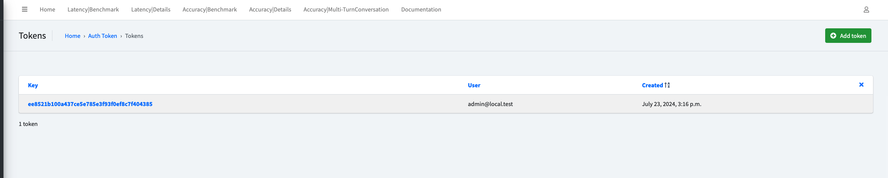
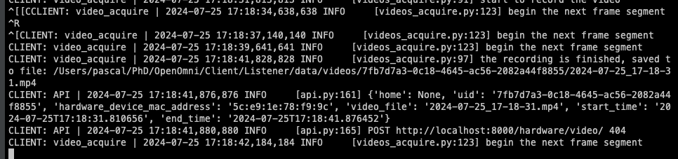

# Private Offline Deployment

It is to offload the Agent/Client/API modules into different machines however within the same network, for potential use
cases like privacy concerns, or to have a more robust system.

One of the example deployment scenario for this is:

- Client: Raspberry Pi to gather the audio and video data
- API: A server to run the API, which can be a laptop or a desktop
- Agent: A PC with Nvidia GPU to run the Agent models

**Local Network File Sync**

To ensure the API/Agent/Client all have access to the files, we will need to sync the files between different machines.

- Client to API: Audio and Video data
- API to Agent: Audio and Video data
- Agent to API: Speech audio data

As other deployment methods, we will first deploy the `API` module.

## **Step 1**: Get API running

Login to the machine your API will deploy on, and clone the repo:

```bash
git clone git@github.com:AI4WA/OpenOmniFramework.git
cd ./OpenOmniFramework
cd ./API
export STORAGE_SOLUTION=local # this is for local mode

# Run it inside docker, this is the easiest way to get started
docker compose up
```

Get your private ip of this machine.

For Mac:

```bash
ipconfig getifaddr en0
```

For Linux:

```bash
hostname -I
```

For Windows:

```bash
ipconfig
```

After this, you should be able to access the API at `http://<private-ip>:8000` for any device within the same network.

## **Step 2**: Get the token

Login to the API admin, go to `http://<private-ip>:8000/authtoken/tokenproxy/` and click `Add Token`.



## **Step 3**: Sync the files between different machines

If you are a Linux or Mac for API module, then you can use `rsync` to sync the files between different machines.

In this way, all you need to do is to start a new terminal and run the following command:

```bash
cd ./OpenOmniFramework
cd ./Client/Listener

source venv/bin/activate

# under this way, STORAGE_SOLUTION in API is local mode
# sync the audio and video data to the API machine
python3 storage.py --token your_token_from_step_2 --dest_dir api_machine_user@api_private_ip:/where/api/folder/is/Client/Listener/data --dest_password api_machine_password
```

If you are a Windows user, you can use the `api` mode storage solution to sync the files between different machines.

All you need to do is in **Step 1**, before starting the API, you need to run the following command:

```bash
export API_STORAGE_MODE=api
```

And then within the `Listener` module, you can run the following command:

```bash
cd ./OpenOmniFramework
cd ./Client/Listener

source venv/bin/activate

# sync the audio and video data to the API machine
python3 storage.py --token your_token_from_step_2 --api_domain http://<private-ip>:8000
```

However, this way will be a bit slower than the `rsync` way, but should not be noticeable for testing purposes.

## **Step 4**: Collect Audio and Video Data

Login to the machine your Client will deploy on, which should have the Camera, Microphone and Speaker, and clone the
repo:

```bash
# switch to a proper directory
git clone git@github.com:AI4WA/OpenOmniFramework.git
```

For the `Listener` part, you will need to run the following commands:

```bash
cd ./OpenOmniFramework
cd ./Client/Listener

export DISPLAY=:0.0 # THIS IS SPECIFIC FOR RASPBERRY PI

# create the virtual environment if this is your first time run this
python3 -m venv venv
source venv/bin/activate
pip3 install -r requirements.txt
pip3 install -r requirements.dev.txt # if you are doing further development

# run video acquire
python3 videos_acquire.py --token your_token_from_step_2 --api_domain http://<private-ip>:8000
```

You should be able to see something like this:



Then open a new terminal

```bash
cd ./OpenOmniFramework
cd ./Client/Listener

source venv/bin/activate

# run audio acquire
python3 audios_acquire.py --token your_token_from_step_2 --track_cluster CLUSTER_GPT_4O_ETE_CONVERSATION  --api_domain http://<private-ip>:8000

# you can change the cluster to the one your need
```

You will see something like this:


## **Step 5**: Run Agent models

Login to the machine your Agent will deploy on, and clone the repo:

```bash
# switch to a proper directory
git clone git@github.com:AI4WA/OpenOmniFramework.git
```

Before you start the Agent, you will also need to first sort out the file sync between the API and Agent machine.

Same as above, if you are a Linux or Mac user, you can use `rsync` to sync the files between different machines.

```bash
cd ./OpenOmniFramework
cd ./Agent

python3 -m venv venv

source venv/bin/activate

pip3 install -r requirements.txt
pip3 install -r requirements.dev.txt # if you are doing further development

# run storage sync from API to Agent, both direction 

python3 storage.py --token your_token_from_step_2 --api_domain http://<private-ip>:8000 --dest_dir api_machine_user@api_private_ip:/where/api/folder/is/OpenOmniFramework/Agent/data --dest_password api_machine_password
```

And then you are free to run the Agent models.

```bash
cd ./OpenOmniFramework
cd ./Agent

source venv/bin/activate

# run the Agent models

python3 main.py --token your_token_from_step_2 --api_domain http://<private-ip>:8000
```

## **Step 6**: Play the response

The speech will be feed with the url, so it is fine, the complex logic is handled within the API side.

```bash
cd ./OpenOmniFramework
cd ./Client/Responder

# create the virtual environment if this is your first time run this
python3 -m venv venv
source venv/bin/activate
pip3 install -r requirements.txt
pip3 install -r requirements.dev.txt # if you are doing further development

# run the audio player

python3 play_speech.py --token your_token
```