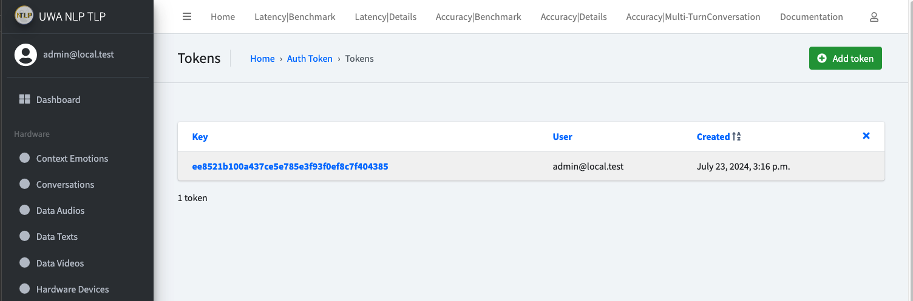

# Tutorial

We will present setup and run the end to end pipeline.

Mainly will include these sections:

- [Setup and run the pipeline successfully](#setup-and-run-the-pipeline-successfully)
- [Evaluation and Annotation Benchmark](#annotation-and-evaluation-benchmark)
- [Pipeline customisation](#pipeline-customisation)
- [Annotation customisation](#annotation-customisation)

---

## Setup and run the pipeline successfully

Deployment mode will be **All in One Local Machine** for demonstration purposes.
This means all of your components will be running on your local machine or your PC.
To get started, you will need a decent machine (as we will run some local LLMs) with camera, microphone and speaker,
which most of the laptops have.

And you will also need to have Python, Docker installed on your machine.

**Step 1**: Clone the repository

```bash
# switch to a proper directory
git clone git@github.com:AI4WA/OpenOmniFramework.git
```

**Step 2**: Get API running

```bash
cd ./OpenOmniFramework
cd ./API
# Run it inside docker, this is the easiest way to get started
docker compose up
```

After this, you should be able to access the API at `http://localhost:8000`.
Username/Password will be `admin/password`.

**Step 3**: Grab the Token for Authentication

Login to the API admin, go to `http://localhost:8000/authtoken/tokenproxy/` and click `Add Token`.



**Step 4**: Collect Audio and Video Data

```bash
cd ./OpenOmniFramework
cd ./Client/Listener

# create the virtual environment if this is your first time run this
python3 -m venv venv
source venv/bin/activate
pip3 install -r requirements.txt
pip3 install -r requirements.dev.txt # if you are doing further development

# run video acquire
python3 videos_acquire.py --token your_token_from_step_3
```

You should be able to see something like this:


Then open a new terminal

```bash
cd ./OpenOmniFramework
cd ./Client/Listener

# create the virtual environment if this is your first time run this
python3 -m venv venv
source venv/bin/activate
pip3 install -r requirements.txt
pip3 install -r requirements.dev.txt # if you are doing further development

# run audio acquire
python3 audios_acquire.py --token your_token_from_step_3 --track_cluster CLUSTER_GPT_4O_ETE_CONVERSATION 
# you can change the cluster to the one your need
```

You will see something like this:


If everything works, you should be able to check the newly create `Data Audios`, `Data Videos` and `Speech2Text` `Tasks`
in API Admin page.
Something like below:


**Step 5**: Run AI models
Now we need to start AI module to consume the `Tasks`.

```bash
cd ./OpenOmniFramework
cd ./AI

python3 -m venv venv
source venv/bin/activate
pip3 install -r requirements.txt
pip3 install -r requirements.dev.txt # if you are doing further development
```

Before we start the AI module, there are some pre configurations we need to do.

As provided functionalities within AI modules support OpenAI call, HuggingFace call, and there is also our provided
emotion detection module.

We need to get them setup first.

*Setup OpenAI and HuggingFace Environment Variable*

Create a `.env` file in `./AI` folder, and add the following content:

```bash
HF_TOKEN=Your_HuggingFace_Token
OPENAI_API_KEY=Your_OpenAI_API_KEY
```

Otherwise, you can run

```bash
export HF_TOKEN=Your_HuggingFace_Token
export OPENAI_API_KEY=Your_OpenAI_API_KEY
```

For the model part, if you want to get our emotion detection model running, you will need to download the model
from [download link](https://openomni.s3.eu-west-1.amazonaws.com/models/emotion_detection.zip)

And put it in the folder: `./AI/data/models/emotion_detection/model_data`.
It should be like this


Then you should be ready to run the AI module.

```bash
# run the AI module
python3 main.py --token your_token_from_step_3
```

You can also skip the steps to install the requirements, directly run the AI module with docker.

```bash
TOKEN=XXX docker compose up
```

This will allow you to utilise the GPU resources on your machine if you have one.


Until now, you will have the client side to feed the video/audio data to the API, and the AI module to consume the data.

**Step 6**: Play speech audio in client side

```bash
cd ./OpenOmniFramework
cd ./Client/Responder

# create the virtual environment if this is your first time run this
python3 -m venv venv
source venv/bin/activate
pip3 install -r requirements.txt
pip3 install -r requirements.dev.txt # if you are doing further development

# run the audio player

python3 play_speech.py --token your_token_from_step_3
```

You will see something like this:


Until now, you should have the whole pipeline running on your local machine.

You should see new tasks created as expected in the `Tasks` page in the API admin page.
As shown below:


And in the Detailed Latency Benchmark page, you should be able to see the latency of each round of conversation.


---

## Evaluation and Annotation Benchmark

So as we mentioned before, we will have two perspectives to evaluate the performance of the pipeline.

- **Latency**
- **Accuracy**

### Latency

For the **latency** part, if you log the time point and duration of each task within the AI module, you should be able
to
automatically get the latency of each round of conversation.
And the results will be presented in two ways:

- Summary Latency Benchmark
- Detailed Latency Benchmark

The above figure is the Detailed Latency Benchmark, which will show the latency of each round of conversation.

The below figure is the Summary Latency Benchmark, which will show the summary statistics of the latency.


### Accuracy

For the **accuracy** part, some of the metrics can be automatically calculated, such as *WER* for Speech2Text. However,
currently, most of the metrics will need human annotation.
And research about how to get this to be automated is still ongoing and worth investigating.

So to solve the problem, we build the annotation functionality for the accuracy part.

#### Annotation System

**Conversation Annotation**

We have a table(Model concept in Django) called conversation to record each round of conversation.

The conversation will be associated with the input

- Data Audio
- Data Video (associated with the Data Audio)
- Data Text (Converted by Speech2Text Task)

and the output

- Response Text (Generated by the AI module, Optional)
- Generated Audio (Generated by the Text2Speech or directly module, Optional)

And the annotation will be based on the input and output.

As shown in this figure:


Initially, the evaluation measurement metrics we built in includes a score [0,5], 5 means the response is perfect, 0
means the response is totally wrong.
In this way, we can calculate a quantitative score for the performance of each component within pipeline.

So for each conversation, you can annotate

- Speech2Text Score: Whether it is perfect, excellent, good, fair, poor, or bad
- Give Speech2Text correct text
- Text Generation Score: Same as the score above, evaluate the response text
- Give Text Generation proper text
- Text2Speech Score: Same as the score above, evaluate the generated audio
- Overall Score: Overall score for the conversation
- Comments: Any comments you want to add, which will be also shown in the benchmark page

One conversation can be annotated by multiple people, and the final score will be the average of all the scores.

The below figure shows the default annotation score:


And the overview of the annotation for a conversation:


The annotated details will be shown in the bottom.

**Customised Component Annotation**

And for a specific component within the pipeline, which will not fit in the conversation table above, we will have a
separate table to record the annotation.
For example, the emotion detection will be a customized task we defined and developed, so we will have a separate table
to record the annotation.

Compared to the above setup, the context part(input and output) will be the same, the annotation measurement metrics
will be different:


**Multi-turn Conversation Annotation**

The conversations actually is mulit-turn, which means we also want to be able to annotate multiple turns conversation.

This is also supported.

You can assign a "Tag" to a group of conversations, then the last conversation within the group will have an extra
annotated field called "Multi turn annotation overall score and comment".


During and after the annotation process, you can track the progress by the *Accuracy|Detail* page.
For example:


After all annotation is done, you can view the summary of the accuracy by the *Accuracy|Benchmark* page.


And your multi turn conversation results can be checked with *Accuracy|Multi-Turn Conversation* page


In summary, for the evaluation benchmark, latency can be automatically calculated, and accuracy will need human
annotation.
Our tool can help the advancement of the auto or semi-auto evaluation accuracy metrics development by collecting this
kind of data.

---

## Pipeline customisation

We have provided a list of built-in Pipelines for demonstration and evaluation purpose.

For example, we got:

- CLUSTER_Q_ETE_CONVERSATION:
    - Speech2Text with local Whisper
    - Emotion Detection
    - Quantization Local LLM
    - Text2Speech
- CLUSTER_Q_NO_EMOTION_ETE_CONVERSATION_NAME:
    - Speech2Text with local Whisper
    - Emotion Detection
    - Quantization Local LLM
    - Text2Speech
- CLUSTER_HF_ETE_CONVERSATION:
    - Speech2Text with local Whisper
    - Emotion Detection
    - HuggingFace Local LLM
    - Text2Speech
- CLUSTER_GPT_4O_ETE_CONVERSATION:
    - Speech2Text OpenAI API
    - GPT-4o with image and text
    - Text2Speech
- CLUSTER_GPT_4O_TEXT_ETE_CONVERSATION:
    - Speech2Text OpenAI API
    - GPT-4o with text only
    - Text2Speech
- CLUSTER_GPT_35_ETE_CONVERSATION:
    - Speech2Text OpenAI API
    - GPT-3.5 with text
    - Text2Speech
- CLUSTER_GPT_35_RAG_ETE_CONVERSATION:
    - Speech2Text OpenAI API
    - GPT-3.5 with text
    - RAG
    - Text2Speech

After the evaluation, we found out, for all of the pipelines, under the Nvidia 3080 GPU, none of the latency is
acceptable.
The best performance is the GPT-3.5 pipeline with text only as input, which has a latency of around 8-10 seconds.
For the GPT-4o, the API latency is around 3-8 seconds, when you feed more images data in, the latency will increase
significantly.

So if you have an idea, and a solution, you want to test out whether it is acceptable, how should you do that?

First go to the code place: `API/orchestrator/chian/clusters.py`

This is the places we put all the pipeline configurations, as shown above.

Here is an example of the pipeline configuration:

```python

"""
Cluster for gpt3.5 model and gpt3.5 with RAG
"""
CLUSTER_GPT_35_RAG_ETE_CONVERSATION_NAME = "CLUSTER_GPT_35_RAG_ETE_CONVERSATION"
CLUSTER_GPT_35_RAG_ETE_CONVERSATION = {
    "openai_speech2text": {
        "order": 0,
        "extra_params": {},
        "component_type": "task",
        "task_name": "openai_speech2text",
    },
    "completed_openai_speech2text": {
        "order": 1,
        "extra_params": {},
        "component_type": "signal",
        "task_name": None,
    },
    "created_data_text": {
        "order": 2,
        "extra_params": {},
        "component_type": "signal",
        "task_name": None,
    },
    "completed_rag": {
        "order": 3,
        "extra_params": {},
        "component_type": "task",
        "task_name": "rag",
    },
    "completed_openai_gpt_35": {
        "order": 4,
        "extra_params": {
            "prompt_template": """{text}""",
        },
        "component_type": "task",
        "task_name": "openai_gpt_35",
    },
    "completed_openai_text2speech": {
        "order": 5,
        "extra_params": {},
        "component_type": "task",
        "task_name": "openai_text2speech",
    },
}
```

First, we need to define a cluster name, which is the pipeline.
This cluster name will be the one when you started your audio acquisition, you can specify which cluster you want to use
by the `--track_cluster`

When you stop talk and the audio acquisition will send the audio you spoke to the API with a track_id, which is in the
format of `T-{cluster_name}-{uid_for_this_conversation}`.
Like: `T-CLUSTER_GPT_35_RAG_ETE_CONVERSATION-f6bf3b78e4f5484abf949790c8451856`.

API side will base on the *cluster_name* to trigger the relevant pipeline and tasks, and all the downstream task for
this conversation within the pipeline will be grouped with this track_id to ensure the pipeline observability.

We have a table called `Task` to manage all the different types of tasks, this can be decomposed to a queue system if we
want to bring this into production for more complex design.
Currently, to maintain a simple and flexible design, every AI task will be recorded inside the `Task` table, and we will
base on this table to analyse the progress of the pipeline, health of the system.


For example, with the track_id above, the example pipeline will be triggered.

First, it will go to create a task, which name will be `openai_speech2text`, and status will be `pending` with proper
parameters.

AI consumer will consume this task, and after the task is done, it will update this task record with the
status `completed`.
And the metadata generated during the AI module running process will be saved in the `result_json` field, with two
primary key

- result_profile: this will store the results we expect for this task, like the generated text
- lantern_profile: this will store the time point information for critical time points and duration information for both
  model inference and data transfer.

It will be like this:


## Annotation customisation
