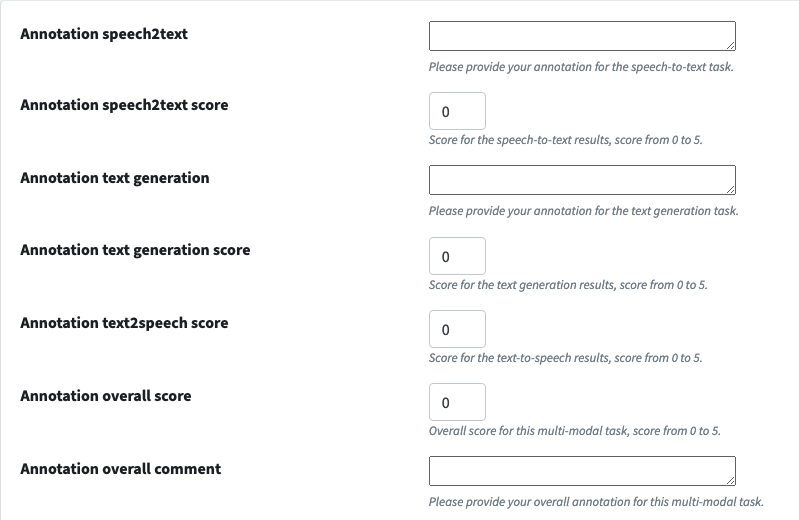

# Annotation customisation

## Explanation

The annotation is built upon the Django Admin interface, which is a powerful tool to manage the data and easy to do the
customisation.

This is one of the reason why we choose Django as the backend framework, as there are heaps of documentations, tools,
packages if you need something more here.

### Conversation Annotation

It is built upon the Django `change_list` template, the code to make this happen is in `API/hardware/admin.py`
and `API/hardware/forms.py`

The class `DataMultiModalConversationAdmin` is where we implement it.

First we will look at the conversation model to see where we store the annotation data:

```python
# API/hardware/models.py

class DataMultiModalConversation(models.Model):
    # ...
    annotations = models.JSONField(
        help_text="The annotations of the emotion detection",
        null=True,
        blank=True,
        default=dict,
    )

    multi_turns_annotations = models.JSONField(
        help_text="The annotations of the multi-turns",
        null=True,
        blank=True,
        default=dict,
    )
    tags = TaggableManager(blank=True)
```

Which means, the annotation will be saved to these two json field: `annotations` and `multi_turns_annotations`.

The saved json will be in following schema:

```json
{
  "1": {
    // 1 is the user id
    "annotation_speech2text": "your annotation",
    "annotation_speech2text_score": 3
    // from 0-5
    // ...
  }
}
```

The annotation field is in

```python
# in API/hardware/forms.py
class MultiModalAnnotationForm(forms.ModelForm):
    annotation_speech2text = forms.CharField(
        required=False,
        widget=forms.Textarea(attrs={"rows": 1}),
        help_text="Please provide your annotation for the speech-to-text task.",
    )
    annotation_speech2text_score = forms.IntegerField(
        initial=0,
        widget=forms.NumberInput(attrs={"min": 0, "max": 5}),
        required=False,
        help_text="Score for the speech-to-text results, score from 0 to 5.",
    )
    annotation_text_generation = forms.CharField(
        required=False,
        widget=forms.Textarea(attrs={"rows": 1}),
        help_text="Please provide your annotation for the text generation task.",
    )

    annotation_text_generation_score = forms.IntegerField(
        initial=0,
        widget=forms.NumberInput(attrs={"min": 0, "max": 5}),
        required=False,
        help_text="Score for the text generation results, score from 0 to 5.",
    )

    annotation_text2speech_score = forms.IntegerField(
        initial=0,
        widget=forms.NumberInput(attrs={"min": 0, "max": 5}),
        required=False,
        help_text="Score for the text-to-speech results, score from 0 to 5.",
    )

    annotation_overall_score = forms.IntegerField(
        initial=0,
        widget=forms.NumberInput(attrs={"min": 0, "max": 5}),
        required=False,
        help_text="Overall score for this multi-modal task, score from 0 to 5.",
    )

    annotation_overall_comment = forms.CharField(
        required=False,
        widget=forms.Textarea(attrs={"rows": 1}),
        help_text="Please provide your overall annotation for this multi-modal task.",
    )

    def __init__(self, *args, **kwargs):
        super().__init__(*args, **kwargs)
        if self.instance.annotations:
            current_user_annotation = self.instance.annotations.get(
                str(self.current_user.id), {}
            )
            for key, value in current_user_annotation.items():
                if key in self.fields:
                    self.fields[key].initial = value
        if self.instance.multi_turns_annotations:
            current_user_annotation = self.instance.multi_turns_annotations.get(
                str(self.current_user.id), {}
            )
            for key, value in current_user_annotation.items():
                if key in self.fields:
                    self.fields[key].initial = value
```

These are the fields show up in the change_list page, as show below:



The code inside the `__init__` function is in charge of making sure present the data you already annotated to you.

The annotation benchmark and details are analysing the data in the `annotations` and `multi_turns_annotations` field.

If you want to add a customised annotation field, all you need to do is to add a field in
the `MultiModalAnnotationForm`.

### Customised Component Annotation

For example, we have an emotion detection task, which will not fit into the conversation model to do the annotation, it
is more like an intermediate task and output for the whole pipeline, however, the quality of it still very important.

So we also want to be able to annotate these types of tasks.

Especially during the process to do the application development, we may introduce specific specialised tasks for
different purposes.

In general, to annotate these types of tasks, the context is still the input and output of the conversation, so when we
design the model, using emotion detection as an example, we use a FK point to the Conversation model.

```python
class ContextEmotionDetection(models.Model):
    multi_modal_conversation = models.ForeignKey(
        DataMultiModalConversation,
        on_delete=models.CASCADE,
        related_name="emotion_detection",
        null=True,
        blank=True,
    )
    result = models.JSONField(
        help_text="The emotion result of the text", null=True, blank=True, default=dict
    )
    logs = models.JSONField(
        help_text="The logs of the emotion detection",
        null=True,
        blank=True,
        default=dict,
    )
    created_at = models.DateTimeField(
        auto_now_add=True, help_text="The created time of the emotion detection"
    )
    updated_at = models.DateTimeField(
        auto_now=True, help_text="The updated time of the emotion detection"
    )

    annotations = models.JSONField(
        help_text="The annotations of the emotion detection",
        null=True,
        blank=True,
        default=dict,
    )

    class Meta:
        verbose_name = "Context Emotion"
        verbose_name_plural = "Context Emotions"
```

As the conversation model, we also have the `annotations` field to store the annotation data.

The schema of the annotation data is the same as the conversation model.

The annotation form is in `API/hardware/forms.py`:

```python


class MultiModalFKEmotionDetectionAnnotationForm(forms.ModelForm):
    annotation_overall = forms.IntegerField(
        initial=0,
        help_text="Overall score for this emotion detection task, score from 0 to 5.",
    )
    annotation_overall.widget.attrs.update({"min": 0, "max": 5})

    annotation_text_modality = forms.IntegerField(
        initial=0, help_text="Score for text modality."
    )
    annotation_text_modality.widget.attrs.update({"min": 0, "max": 5})

    annotation_audio_modality = forms.IntegerField(
        initial=0, help_text="Score for audio modality."
    )
    annotation_audio_modality.widget.attrs.update({"min": 0, "max": 5})

    annotation_video_modality = forms.IntegerField(
        initial=0, help_text="Score for video modality."
    )
    annotation_video_modality.widget.attrs.update({"min": 0, "max": 5})

    def __init__(self, *args, **kwargs):
        super().__init__(*args, **kwargs)

        if self.instance.annotations:
            current_user_annotation = self.instance.annotations.get(
                str(self.current_user.id), {}
            )
            for key, value in current_user_annotation.items():
                if key in self.fields:
                    self.fields[key].initial = value
```

The form is similar to the conversation annotation form, but the fields are different.

So if you want to implement one by yourself, all you need to do is copying this for your model.