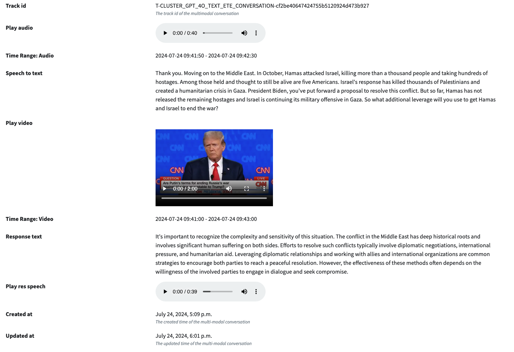

# Evaluation and Annotation Benchmark

So as we mentioned before, we will have two perspectives to evaluate the performance of the pipeline.

- **Latency**
- **Accuracy**

## Latency

For the **latency** part, if you log the time point and duration of each task within the Agent module, you should be able
to
automatically get the latency of each round of conversation.
And the results will be presented in two ways:

- Summary Latency Benchmark
- Detailed Latency Benchmark

The above figure is the Detailed Latency Benchmark, which will show the latency of each round of conversation.

The below figure is the Summary Latency Benchmark, which will show the summary statistics of the latency.

## Accuracy

For the **accuracy** part, some of the metrics can be automatically calculated, such as *WER* for Speech2Text. However,
currently, most of the metrics will need human annotation.
And research about how to get this to be automated is still ongoing and worth investigating.

So to solve the problem, we build the annotation functionality for the accuracy part.

### Annotation System

**Conversation Annotation**

We have a table(Model concept in Django) called conversation to record each round of conversation.

The conversation will be associated with the input

- Data Audio
- Data Video (associated with the Data Audio)
- Data Text (Converted by Speech2Text Task)

and the output

- Response Text (Generated by the Agent module, Optional)
- Generated Audio (Generated by the Text2Speech or directly module, Optional)

And the annotation will be based on the input and output.

As shown in this figure:

Initially, the evaluation measurement metrics we built in includes a score [0,5], 5 means the response is perfect, 0
means the response is totally wrong.
In this way, we can calculate a quantitative score for the performance of each component within pipeline.

So for each conversation, you can annotate

- Speech2Text Score: Whether it is perfect, excellent, good, fair, poor, or bad
- Give Speech2Text correct text
- Text Generation Score: Same as the score above, evaluate the response text
- Give Text Generation proper text
- Text2Speech Score: Same as the score above, evaluate the generated audio
- Overall Score: Overall score for the conversation
- Comments: Any comments you want to add, which will be also shown in the benchmark page

One conversation can be annotated by multiple people, and the final score will be the average of all the scores.

The below figure shows the default annotation score:

And the overview of the annotation for a conversation:

The annotated details will be shown in the bottom.

**Customised Component Annotation**

And for a specific component within the pipeline, which will not fit in the conversation table above, we will have a
separate table to record the annotation.
For example, the emotion detection will be a customized task we defined and developed, so we will have a separate table
to record the annotation.

Compared to the above setup, the context part(input and output) will be the same, the annotation measurement metrics
will be different:

**Multi-turn Conversation Annotation**

The conversations actually is mulit-turn, which means we also want to be able to annotate multiple turns conversation.

This is also supported.

You can assign a "Tag" to a group of conversations, then the last conversation within the group will have an extra
annotated field called "Multi turn annotation overall score and comment".

During and after the annotation process, you can track the progress by the *Accuracy|Detail* page.
For example:

After all annotation is done, you can view the summary of the accuracy by the *Accuracy|Benchmark* page.

And your multi turn conversation results can be checked with *Accuracy|Multi-Turn Conversation* page

In summary, for the evaluation benchmark, latency can be automatically calculated, and accuracy will need human
annotation.
Our tool can help the advancement of the auto or semi-auto evaluation accuracy metrics development by collecting this
kind of data.

