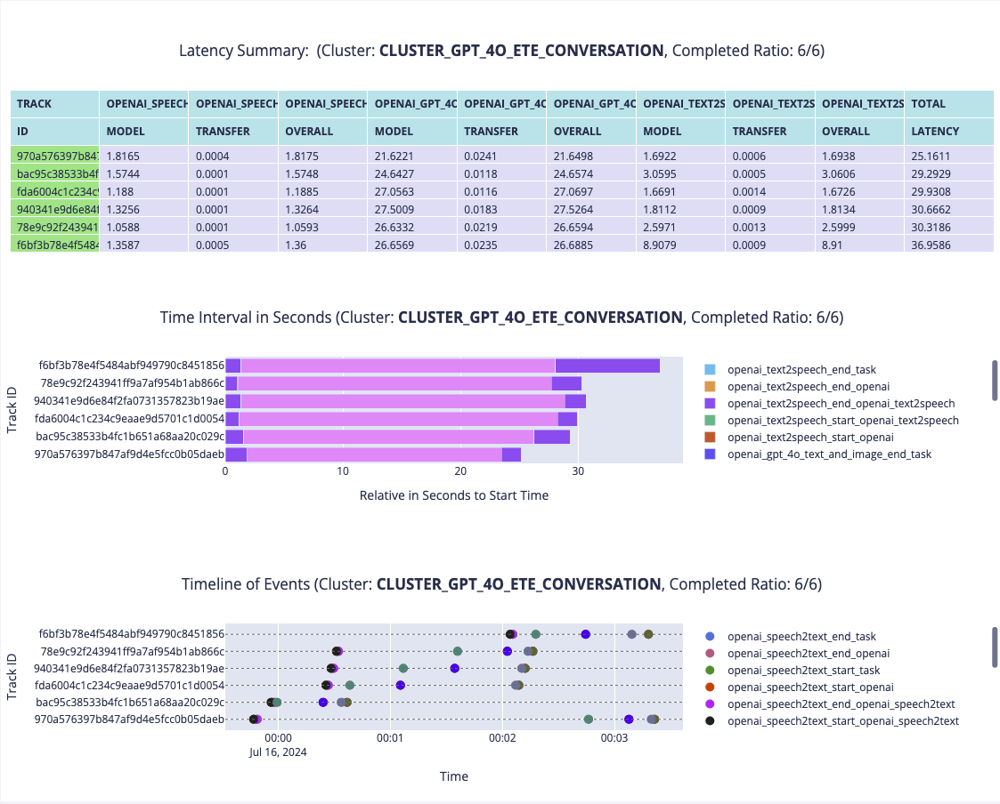
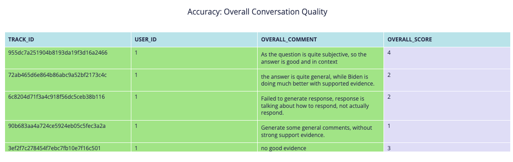

# Case Study

After the system is set up, we tested the pipeline with two cases:

- US Election Debate:
    - In this case, we download the video, and then sample the video into segments, which will be used as video and
      audio input for the pipeline.
    - This way can solve one of the problem that the multimodal conversational AI research is lacking of the dataset.
- Assist the visually impaired:
    - This is in the real world scenario, where we will use the pipeline to assist the visually impaired people when
      they
      are indoors.
    - It is not that critical for the latency, so potential can be applied even in current latency situation, because
      the AI accuracy is quite high now.

## US Election Debate

One of the intensive conversational scenarios is the debate.
We extracted segments from the US Presidential Debate 2024
between [Biden and Trump](https://www.youtube.com/watch?v=-v-8wJkmwBY), focusing on Biden addressing the
public and handling questions.
These segments were fed into our pipeline to evaluate its performance under different
configurations:

- OpenAI's Whisper for speech-to-text, GPT-4o vision model, and text-to-speech (GPT4O_ETE);
- a locally deployed quantization LLM with Whisper, text-to-speech, and our emotion detection model for video (
  QuantizationLLM_ETE)
- replacing the quantization LLM with Hugging Face LLM for inference (HF_ETE)
- and a version using only Whisper, GPT-3.5, and text-to-speech, ignoring video modality (GPT35_ETE).

We ran the AI modules on a NVIDIA-3080 GPU with 12GB memory.

To replicate what we are doing, you can download the video
from [link](https://openomni.s3.eu-west-1.amazonaws.com/models/US-Election-2024.mp4)

Put in under the folder `Client/Listener/data/mock/US-Election-2024.mp4`

And then you can run the following command:

```bash
cd ./Client/Listener
source venv/bin/activate
 python3 -m mock.data_extraction --input_video_path your/repo/path/US-Election-2024.mp4 --api_domain  https://openomni.ai4wa.com --token your_token --time_points 02:53,3:20,20:20,20:39,33:38,34:18,55:15,55:40,80:05,80:18
```

*You need to run the rest modules, make the running properly*

And all the pipelines we have set up will be fired, all you need to do is to wait for the results.

### Results




After annotation, the accuracy performance is here:



The fastest configuration is GPT35_ETE, averaging around 15 seconds, with most of the time consumed by the
text-to-speech part, as the generated content is quite long and comprehensive. The slowest configuration is HF_ETE,
taking around 189 seconds, with the LLM model inference step taking the longest time. QuantizationLLM_ETE takes around
60 seconds, with LLM model inference taking around 28 seconds and our emotion detection model taking around 10 seconds.

After annotation with our provided interface, the accuracy statistics are automatically generated. As shown in Figure~
\ref{fig:gpt4oaccuracy}, speech-to-text accuracy is good, while text-to-speech can be improved with more natural emotion
or personality. The text generation, however, is often too general and sometimes inappropriate. Biden's responses are
more in-context and supported by evidence. The only question where our pipeline performed well was the subjective
question about Biden's age, where the GPT-4o pipeline excelled.

The GPT35_ETE pipeline had the best overall accuracy, but its responses were often in-context yet pompous. Thus, Biden
still outperforms AI.

In conclusion, AI cannot be the President of the US for now, from both latency and accuracy perspectives.

## Help visual impaired people when indoors

While latency and the need for external information currently prevent AI from being the President of the US, the current
state of conversational AI can be production-ready and useful for areas that are not latency-critical and do not require
extensive external knowledge. Assisting indoor activities for the visually impaired can be one such potential
application area.

We set up a camera, microphone, and speaker, and then prepared several types of questions useful for the visually
impaired population. These included questions about the location of specific objects and how to grab them, navigating to
another position indoors, and inquiries about the surrounding environment. We sampled six questions and fed them to the
GPT4O_ETE pipeline. The latency statistics show that each
conversational request from the user is responded to within approximately 30 seconds, which is expected under the
hardware setup.

After annotation with context, the accuracy performance is impressive, with an overall score of 4.7/5. Most responses
are accurate; however, the LLM lacks specific skills for assisting the visually impaired. For example, when asked *where
the keyboard is*, the response could include more instructive steps on how to grab it rather than a general description.
This indicates that while the conversational AI is nearly production-ready for assisting the visually impaired with
indoor activities, improvements in latency and response content are still needed.