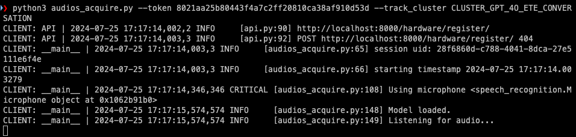
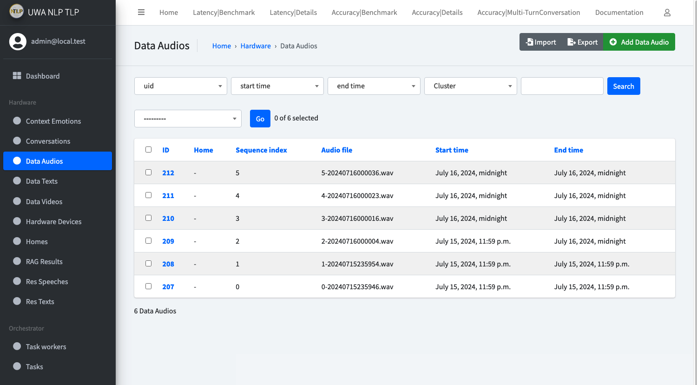
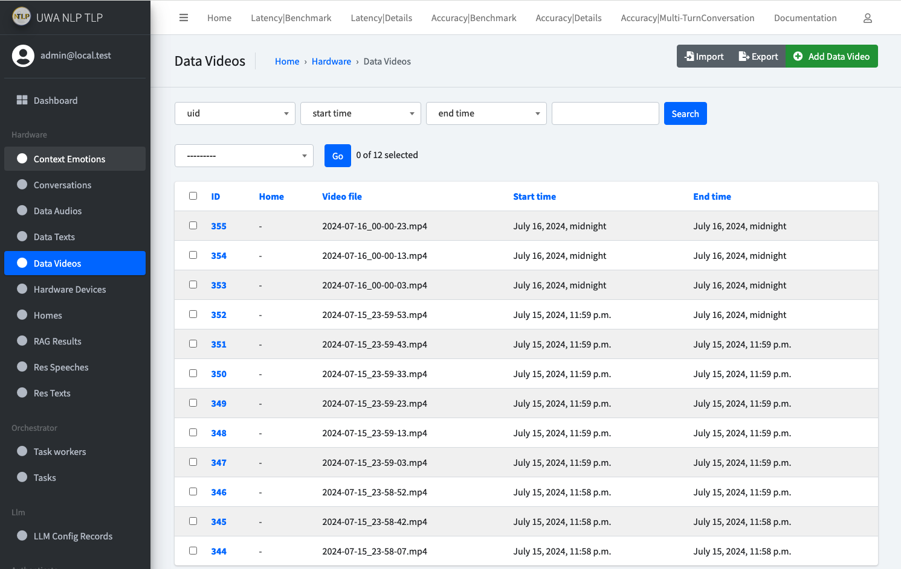
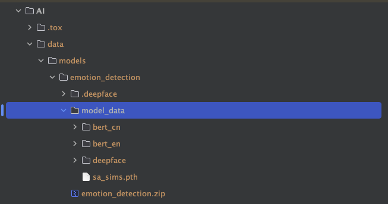
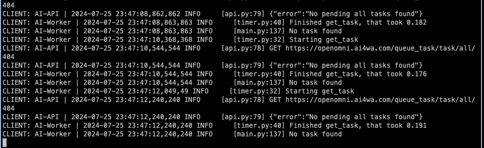
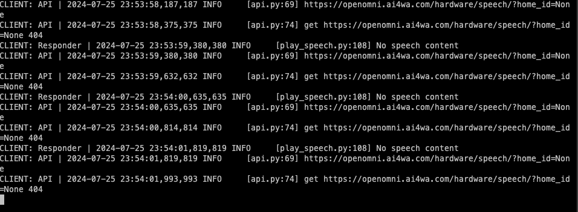
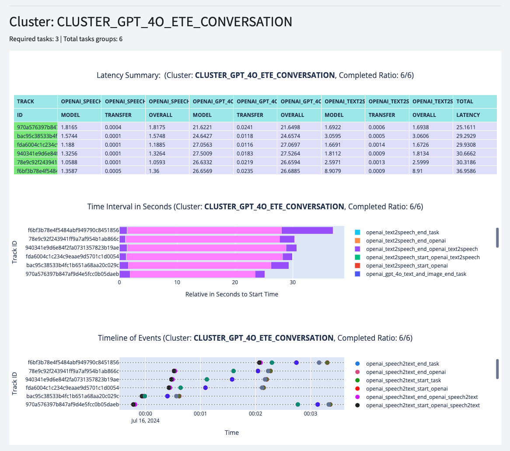

# Setup and run the pipeline successfully

Deployment mode will be **All in One Local Machine** for demonstration purposes.
This means all of your components will be running on your local machine or your PC.
To get started, you will need a decent machine (as we will run some local LLMs) with camera, microphone and speaker,
which most of the laptops have.

And you will also need to have Python, Docker installed on your machine.

**Step 1**: Clone the repository

```bash
# switch to a proper directory
git clone git@github.com:AI4WA/OpenOmniFramework.git
```

**Step 2**: Get API running

```bash
cd ./OpenOmniFramework
cd ./API
# Run it inside docker, this is the easiest way to get started
docker compose up
```

After this, you should be able to access the API at `http://localhost:8000`.
Username/Password will be `admin/password`.

**Step 3**: Grab the Token for Authentication

Login to the API admin, go to `http://localhost:8000/authtoken/tokenproxy/` and click `Add Token`.


**Step 4**: Collect Audio and Video Data

```bash
cd ./OpenOmniFramework
cd ./Client/Listener

# create the virtual environment if this is your first time run this
python3 -m venv venv
source venv/bin/activate
pip3 install -r requirements.txt
pip3 install -r requirements.dev.txt # if you are doing further development

# run video acquire
python3 videos_acquire.py --token your_token_from_step_3
```

You should be able to see something like this:


Then open a new terminal

```bash
cd ./OpenOmniFramework
cd ./Client/Listener

# create the virtual environment if this is your first time run this
python3 -m venv venv
source venv/bin/activate
pip3 install -r requirements.txt
pip3 install -r requirements.dev.txt # if you are doing further development

# run audio acquire
python3 audios_acquire.py --token your_token_from_step_3 --track_cluster CLUSTER_GPT_4O_ETE_CONVERSATION 
# you can change the cluster to the one your need
```

You will see something like this:


If everything works, you should be able to check the newly create `Data Audios`, `Data Videos` and `Speech2Text` `Tasks`
in API Admin page.
Something like below:




**Step 5**: Run AI models
Now we need to start AI module to consume the `Tasks`.

```bash
cd ./OpenOmniFramework
cd ./AI

python3 -m venv venv
source venv/bin/activate
pip3 install -r requirements.txt
pip3 install -r requirements.dev.txt # if you are doing further development
```

Before we start the AI module, there are some pre configurations we need to do.

As provided functionalities within AI modules support OpenAI call, HuggingFace call, and there is also our provided
emotion detection module.

We need to get them setup first.

*Setup OpenAI and HuggingFace Environment Variable*

Create a `.env` file in `./AI` folder, and add the following content:

```bash
HF_TOKEN=Your_HuggingFace_Token
OPENAI_API_KEY=Your_OpenAI_API_KEY
```

Otherwise, you can run

```bash
export HF_TOKEN=Your_HuggingFace_Token
export OPENAI_API_KEY=Your_OpenAI_API_KEY
```

For the model part, if you want to get our emotion detection model running, you will need to download the model
from [download link](https://openomni.s3.eu-west-1.amazonaws.com/models/emotion_detection.zip)

And put it in the folder: `./AI/data/models/emotion_detection/model_data`.
It should be like this



Then you should be ready to run the AI module.

```bash
# run the AI module
python3 main.py --token your_token_from_step_3
```

You can also skip the steps to install the requirements, directly run the AI module with docker.

```bash
TOKEN=XXX docker compose up
```

This will allow you to utilise the GPU resources on your machine if you have one.



Until now, you will have the client side to feed the video/audio data to the API, and the AI module to consume the data.

**Step 6**: Play speech audio in client side

```bash
cd ./OpenOmniFramework
cd ./Client/Responder

# create the virtual environment if this is your first time run this
python3 -m venv venv
source venv/bin/activate
pip3 install -r requirements.txt
pip3 install -r requirements.dev.txt # if you are doing further development

# run the audio player

python3 play_speech.py --token your_token_from_step_3
```

You will see something like this:



Until now, you should have the whole pipeline running on your local machine.

You should see new tasks created as expected in the `Tasks` page in the API admin page.
As shown below:


And in the Detailed Latency Benchmark page, you should be able to see the latency of each round of conversation.



